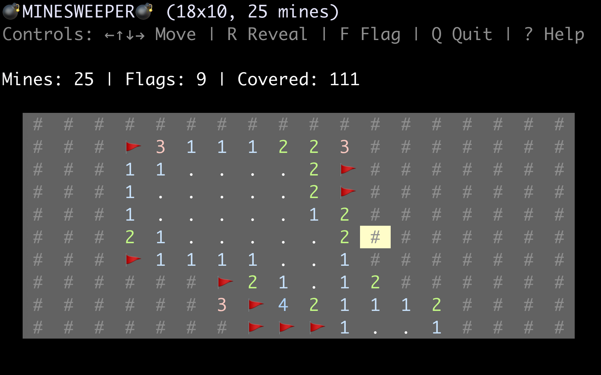

# minesweeper-rs

A classic game of Minesweeper [1,2] for your terminal, written in Rust and built with `crossterm`.

## Preview




## Features

-   **Configurable Board:** Set the width, height, and number of mines.
-   **Vim Keybindings:** Navigate with `h`, `j`, `k`, `l` in addition to arrow keys.
-   **Guaranteed Safe First Click:** You will never hit a mine on your first move.
-   **In-Game Help:** Press `?` anytime to see the controls.
-   **Clean & Responsive UI:** Built with `crossterm` for a smooth, flicker-free experience.

## References

1. [Wikipedia](https://en.wikipedia.org/wiki/Minesweeper_(video_game)
2. [minesweeper.com](https://minesweepergame.com/)


## Installation

You must have the Rust toolchain installed. You can install it via [rustup.rs](https://rustup.rs/).
1.  **Clone the repository:**
    ```bash
    git clone https://github.com/jesper-olsen/minesweeper-rs.git
    cd minesweeper-rs
    ```

2.  **Build the release binary:**
    ```bash
    cargo build --release
    ```
    The executable will be located at `target/release/minesweeper-rs`.

## Usage

```bash
% cargo run --release -- --help

Usage: minesweeper-rs [OPTIONS]

Options:
      --width <WIDTH>          number of columns [default: 18]
      --height <HEIGHT>        number of rows [default: 10]
      --num-mines <NUM_MINES>  number of mines [default: 25]
  -h, --help                   Print help
  -V, --version                Print version
```

Run the executable directly to start a game with default settings:

```bash
./target/release/minesweeper-rs
```

Or, customize the board size and mine count:

```bash
# A large board for experts
./target/release/minesweeper-rs --width 30 --height 20 --num-mines 99
```

## License

This project is licensed under the [MIT License](LICENSE).
