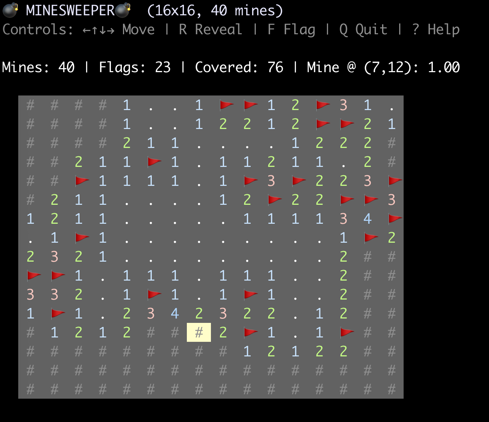

# minesweeper-rs

A classic game of Minesweeper [1,2] for the terminal, written in Rust and built with `crossterm`.

## Quick Start
Play beginner difficulty (default)
```bash
cargo run --release
```

Or try intermediate
```bash
cargo run --release -- -d intermediate
```

|  |
| --- |


## Features

-   **Configurable Board:** Set the width, height, and number of mines.
-   **Vim Keybindings:** Navigate with `h`, `j`, `k`, `l` in addition to arrow keys.
-   **Safe First Click:** Never hit a mine on the first move.
-   **In-Game Help:** Press `?` anytime to see the controls.
-   **Smart Mine Validation:** Automatically prevents impossible configurations.
-   **Optional Solver Assistance:** With `--display-bomb-prob`, the game calculates and shows the estimated probability of a mine being under the current cursor cell.


## References

1. [Wikipedia](https://en.wikipedia.org/wiki/Minesweeper_(video_game))
2. [minesweeper.com](https://minesweepergame.com/)
3. ["Minesweeper is NP-complete", Mathematical Intelligencer, Vol 22, No 2, 9-15, 2000](https://academic.timwylie.com/17CSCI4341/minesweeper_kay.pdf)
4. [A simple Minesweeper algorithm", Mike Sheppard, October 9, 2023](https://minesweepergame.com/math/a-simple-minesweeper-algorithm-2023.pdf)


## Installation

1. **Install Rust via [rustup.rs](https://rustup.rs/)**:
2. **Clone the repository:**
    ```bash
    git clone https://github.com/jesper-olsen/minesweeper-rs.git
    cd minesweeper-rs
    ```
3.  **Build the release binary:**
    ```bash
    cargo build --release
    ```
    The executable will be located at `target/release/minesweeper-rs`.


## Usage

```bash
Usage: minesweeper-rs [OPTIONS]

Options:
  -d, --difficulty <DIFFICULTY>  Use a classic difficulty preset (overrides width/height/mines) [possible values: beginner, intermediate, expert]
      --width <WIDTH>            Number of columns (ignored if difficulty is set) [default: 9]
      --height <HEIGHT>          Number of rows (ignored if difficulty is set) [default: 9]
      --num-mines <NUM_MINES>    Number of mines (ignored if difficulty is set) [default: 10]
      --list-difficulties        List available difficulty presets and exit
      --display-bomb-prob        display bomb probabilities - in the status bar for cell under the cursor
  -h, --help                     Print help
  -V, --version                  Print version
```

```bash
% cargo run --release -- --list-difficulties

Available difficulties:
  beginner     - 9x9, 10 mines (8%)
  intermediate - 16x16, 40 mines (16%)
  expert       - 30x16, 99 mines (21%)
```


## License

This project is licensed under the [MIT License](LICENSE).
