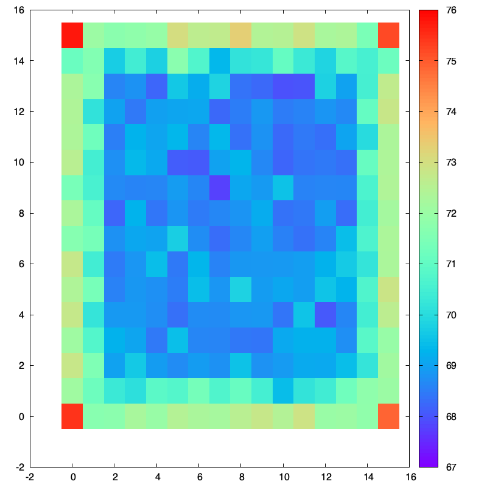

# Solver Analysis

## Minesweeper Rules

Solving minesweeper is a combination of inferencing and guessing.
On the opening move there are no clues other than the total number of
mines. Minesweeper clones typically implement one of three policies for
the first move:

* **Unprotected**: The first move can hit a mine.
* **Guaranteed Safe**: The first move is guaranteed not to hit a mine.
* **Guaranteed Zero**: The first move is guaranteed to hit a zero-cell.

Early versions of minesweeper, e.g. Windows 3.1, implemented the unprotected policy.
Later this was changed to Guaranteed Safe and Guaranteed Zero. Guaranteed zero means
the first move will cause a cascade and a board more open to inference rather than
guessing.

## Results

To determine how the opening policy influences the best initial move, the solver was
run 10k times for each square:

| Policy         | Level        | Best Win rate | Worst Win rate |
|:---------------|:-------------|:--------------|:---------------|
| Unprotected    | Beginner     | 79.41%        | 72.77%         |
| GuaranteedSafe | Beginner     | 90.24%        | 82.42%         |
| GuaranteedZero | Beginner     | 98.46%        | 96.41%         |
| GuaranteedSafe | Intermediate | 75.74%        | 67.74%         |
| GuaranteedZero | Intermediate | 91.37%        | 84.97%         |
| GuaranteedSafe | Expert       | 35.32%        | 30.40%         |

The following heatmaps illustrate the win rate for each board square:

### Beginner Level

    <table>
        <tr>
            <td></td>
            <td></td>
            <td></td>
        </tr>
    </table>
     
    
Figure 1: Win Rate Heatmaps for Beginner Level, showing Unprotected (left), Guaranteed Safe (center), and Guaranteed Zero (right).

### Intermediate Level 

<figure>
  
  <figcaption align="center">Figure 4: Win Rate Heatmap for Intermediate - Guaranteed Safe Policy</figcaption>
</figure>
 
 
 

<figure>
  
  <figcaption align="center">Figure 5: Win Rate Heatmap for Intermediate - Guaranteed Zero Policy</figcaption>
</figure>
 
 
 

### Expert Level

<figure>
  
  <figcaption align="center">Figure 6: Win Rate Heatmap for Expert - Guaranteed Safe Policy</figcaption>
</figure>
 
 
 

<figure>
  
  <figcaption align="center">Figure 7: Win Rate Heatmap for Expert - Guaranteed Zero Policy</figcaption>
</figure>
 
 
 

**Summary of Findings**

Unprotected and Guaranteed Safe are very similar policies - the corners are the best
openings, followed by the edges while the interior is uniformly the same.

This can be understood by considering the probability of revealing a zero cell, which is highly desirable as it leads to a cascade. With a uniform bomb distribution, corner cells (with 3 neighbors) have a higher probability of being a zero cell than interior cells (with 8 neighbors)."

For the Guaranteed Zero rule, the dynamics change. The policy guarantees a zero cell, meaning that clicking an interior cell reveals a block of at least 9 cells, while a corner reveals only a block of 4.

